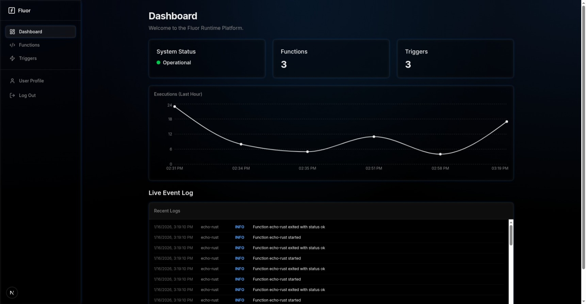

<div align="center">
  <h1>Fluor</h1>
  <p>
    <strong>Fluor is a high-performance, secure, and lightweight Serverless Runtime platform built with Rust and WebAssembly. It enables you to deploy and run function-as-a-service (FaaS) workloads with millisecond cold starts and strong isolation.</strong>
  </p>
  <p>

[](https://github.com/richardnas/fluor/actions?query=workflow%3ACI)
[](LICENSE)

  </p>
</div>




## Key Features

- **WASM Runtime**: Functions run in secure, isolated WebAssembly sandboxes using `Wasmtime`.
- **Polyglot Support**: Write functions in Rust, Python, JavaScript (and any language compiling to WASM/WASI).
- **Event-Driven**: Trigger functions via HTTP requests, timers/CRON, or internal events.
- **Real-time Telemetry**: Integrated OpenTelemetry tracing and logging backed by ClickHouse.
- **Modern Dashboard**: A sleek, responsive UI built with Next.js 14 and Tailwind CSS for managing resources.
- **Secure by Design**: JWT Authentication, Argon2 password hashing, and granular resource permissions.

## Architecture

Fluor is composed of three main components:

### 1. Fluor API (Backend)
- **Language**: Rust
- **Framework**: Actix Web
- **Runtime**: Wasmtime (for executing user functions)
- **Database**: 
  - **SQLite**: Stores control plane data (users, functions, triggers).
  - **ClickHouse**: Stores high-volume telemetry data (traces, logs).
- **Responsibility**: Manages the lifecycle of functions, handles authentication, and orchestrates function execution.

### 2. Fluor UI (Frontend)
- **Framework**: Next.js 14 (App Router)
- **Styling**: Tailwind CSS, Shadcn UI
- **Features**: 
  - Server Actions for secure data mutation.
  - Real-time visualizations (Recharts) for execution metrics.
  - Live log streaming.

## Technology Stack

- **Core**: Rust, WebAssembly (WASI P1)
- **Web**: TypeScript, React, Next.js
- **Data**: SQLite, ClickHouse
- **Observability**: OpenTelemetry

## Getting Started

### Prerequisites
- **Rust**: Latest stable toolchain (`rustup`).
- **Node.js**: v20+.
- **Docker**: For running ClickHouse.
- **Make**: For build automation.

### Installation

1. **Start Infrastructure**
   ```bash
   # Starts ClickHouse
   docker-compose up -d
   ```

2. **Build & Run API**
   ```bash
   cd api
   # Setup database and build modules
   make setup
   make build-modules
   # Run the server
   cargo run
   ```

3. **Run UI**
   ```bash
   cd ui
   npm install
   npm run dev
   ```

4. **Access Dashboard**
   - Open browser at `http://localhost:3000`.
   - Default credentials (if seeded): check `api/src/infrastructure/db/sqlite.rs` or register a new user.

## Usage

### Deploying a Function
Upload a compiled `.wasm` file via the UI or API.
- **Rust Example**: `cargo build --target wasm32-wasip1 --release`
- **Python Example**: Use `componentize-py` to bundle your script.

### Creating a Trigger
- **HTTP**: Exposes your function at `http://localhost:8080/functions/{name}`.
- **Timer**: Schedules execution (e.g., "every 5 minutes").

### Contributions
Contributions in the form of bug reports, feature requests, or pull requests are welcome.

### License
Fluor Functions is licensed under the [MIT License](LICENSE).
