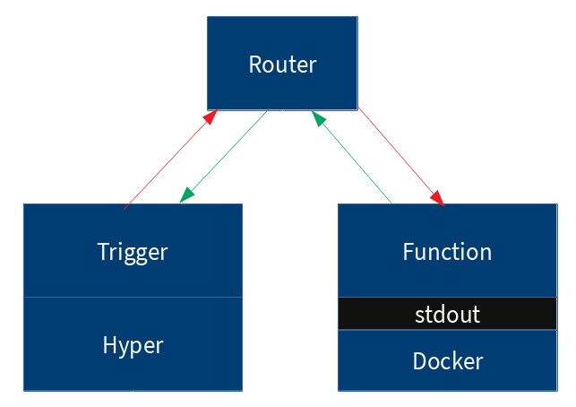

<h1 style="text-align: center">Fluor Functions</h1>

Fluor Functions is a <b>experimental</b> serverless platform written in Rust.

## Architecture

## Requirements

- [Docker CE](https://docs.docker.com/install/)

## Examples

- [Hello World example in Rust](examples/rust)

- [Hello World example in Python](examples/python)

- [Show all examples](examples)

# TODO
- [ ] Create CLI
- [ ] Create Web UI
- [ ] Create SDK
- [ ] Templates for more programming languages
- [ ] Optimizations (reduce function latency)
- [ ] Support for other operating systems

## Contributions
Contributions in the form of bug reports, feature requests, or pull requests are welcome. 

## License

Fluor Functions is licensed under the [MIT License](LICENSE)
